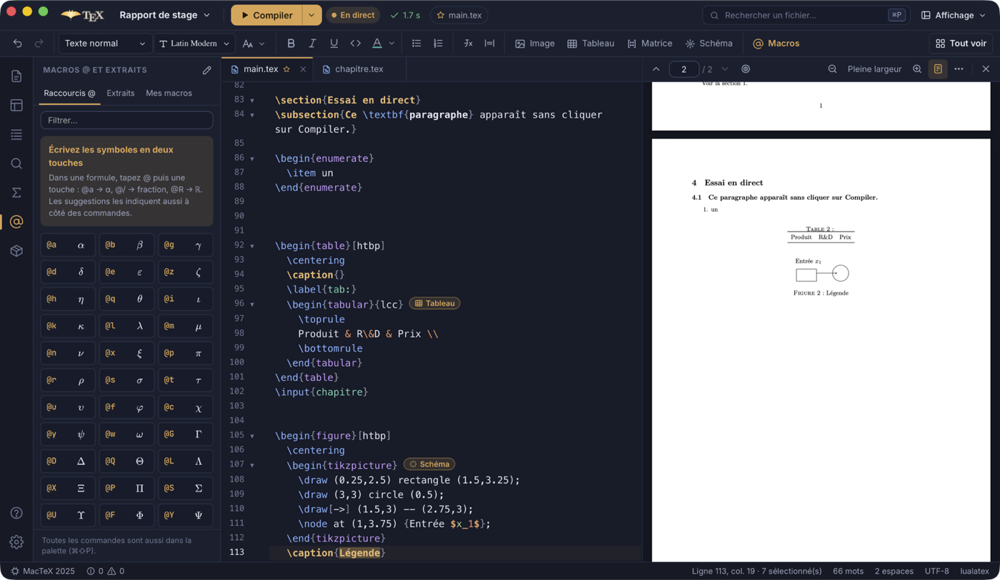
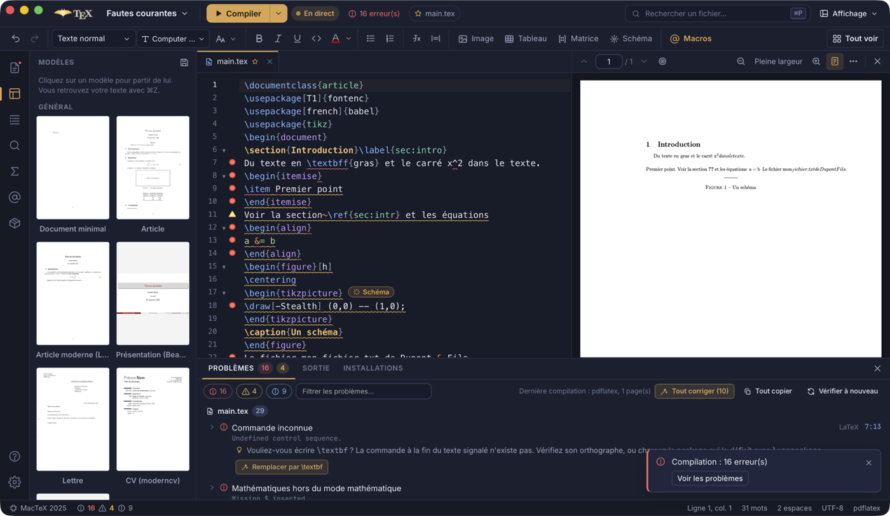
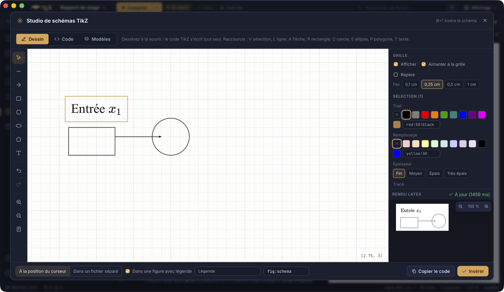

<p align="center">
  
</p>

<h1 align="center">RayTeX</h1>

<p align="center">
  <strong>L'éditeur LaTeX moderne pour les étudiants, les enseignants et les chercheurs.</strong><br />
  Rapide, libre, pour Linux, macOS et Windows. Écrit en Rust.
</p>

<p align="center">
  <a href="https://github.com/ifanoxy/raytex/actions/workflows/ci.yml"></a>
  <a href="#licence"></a>
  <a href="https://github.com/ifanoxy/raytex/releases"></a>
</p>

<p align="center">
  <a href="README.md">English</a> · Français
</p>

---

RayTeX aide les débutants à apprendre et laisse les experts aller vite : aperçu en direct, autocomplétion apprise de **tous** les packages installés, console d'erreurs précise qui explique chaque problème et corrige les plus courants en un clic (ou tous à la fois), SyncTeX, modèles, macros et configuration guidée de **n'importe quelle** distribution TeX.

<p align="center">
  
</p>

## Fonctionnalités

**Écrire**
- Une barre de mise en forme comme dans un traitement de texte : annuler / rétablir, style de la ligne (titres), taille du texte, gras, italique, souligné, couleur, alignement, listes, formules, image, tableau (taille choisie sur une grille), schéma TikZ, liens et renvois ; **Tout voir** liste toutes les commandes avec leur raccourci. La barre du haut garde le projet, la compilation et un menu **Affichage** ; l'aperçu PDF et la console se ferment par une croix.
- Autocomplétion selon le contexte : commandes et environnements du noyau LaTeX, de chaque package chargé par le document (lus dans la source du package, quel qu'il soit), de vos `\newcommand` ; étiquettes avec leur numéro, citations avec auteurs et titre, fichiers, options, couleurs.
- L'autocomplétion crée les accolades et les laisse vides, à vous de les remplir ; choisir une commande d'un package non chargé ajoute le `\usepackage`.
- Les clés et valeurs des arguments, avec leur documentation : `\includegraphics[width=…]`, `\begin{itemize}[label=…]`, `\hypersetup{…}`, `\geometry{…}`, siunitx, listings, minted, tcolorbox, fontspec, TikZ, pgfplots, beamer… (environ 520 clés documentées, plus celles que déclare chaque package installé). Dans un argument libre, une info-bulle dit ce qu'on y met (`\item[terme]` : le texte affiché à la place de la puce).
- Un éditeur de matrices et de tableaux rempli case par case (Entrée pour passer à la case suivante, collage depuis un tableur, mise en forme LaTeX et macros dans les cases, aperçu en direct) ; une pastille après `\begin{pmatrix}`, `\begin{tabular}`, `\includegraphics` ou `\begin{tikzpicture}` rouvre l'éditeur correspondant sur ce code.
- Aperçu des formules en direct (KaTeX, avec vos macros), documentation au survol, aperçu des images.
- Les polices depuis la barre de mise en forme : polices du texte, des titres, du code et des maths d'un coup d'œil, chacune changée ou remise par défaut en un clic, et des polices pour un passage appliquées à la sélection ; des couleurs qui suivent le document (toutes celles de `xcolor`, `dvipsnames` et SVG quand xcolor est chargé, les couleurs du document, toute couleur au choix).
- Console et problèmes dont le texte se sélectionne et se copie.
- Raccourcis `@` en mode mathématique (`@a` → `\alpha`, `@/` → fraction), indiqués à côté des commandes dans les suggestions et dessinés dans leur propre panneau ; extraits ; macros personnelles avec déclencheurs et raccourcis clavier.
- Aller à la définition, trouver les références, renommer étiquettes, clés de citation et commandes dans tout le projet.
- `$` ne s'ouvre en paire que là où une formule peut commencer ; renommer un `\begin{…}` renomme son `\end{…}` ; `Ctrl/⌘ + Z` annule où que soit le focus, `Ctrl/⌘ + Maj + Z` ou `Ctrl/⌘ + Y` rétablit.
- Les fichiers vides proposent de quoi commencer (modèle, document minimal, section, inclusion dans le document principal, entrées de bibliographie).
- Fermeture automatique des environnements, listes qui se continuent, repli, curseurs multiples, mode Vim, correcteur orthographique.

**Images, schémas et polices**
- *Insérer des images* : choisissez, collez ou déposez des images (ou prenez celles du projet) ; dossier, nom de fichier sûr pour LaTeX, largeur avec aperçu de la page, position, légende et étiquette ; plusieurs images deviennent des sous-figures. Les SVG sont convertis en PDF vectoriel, WebP/GIF/HEIC/BMP/TIFF en PNG ; `graphicx`, `subcaption`, `float` sont ajoutés si besoin.
- *Studio TikZ* : un **tableau blanc** pour dessiner à la souris sur une grille fine et réglable (le code TikZ s'écrit tout seul et reste lié au dessin dans les deux sens), une galerie de 22 schémas (courbes, organigramme, arbre, carte mentale, Venn, géométrie, circuit, automate, graphe, réseau de neurones, diagramme commutatif…), des boutons d'éléments et de styles, un aperçu compilé en direct avec le préambule du document, une grille en centimètres, les coordonnées insérées d'un clic, l'insertion au curseur ou dans un fichier séparé, les packages et `\usetikzlibrary` ajoutés automatiquement ; modification d'un schéma existant sur place.
- *Polices* : n'importe quelle police de l'ordinateur ou des fichiers de police copiés dans le projet (fontspec, chaque style nommé, passage à LuaLaTeX), ou des packages de polices LaTeX qui fonctionnent aussi avec pdfLaTeX, toujours avec un aperçu compilé.

**Compiler**
- En direct par défaut : le document est compilé à chaque pause dans la frappe et le PDF suit ; ou une touche (`Ctrl/⌘ + Entrée`), ou à l'enregistrement.
- La console ne s'ouvre jamais d'elle-même : les erreurs sont soulignées, comptées dans la barre du haut et annoncées après une compilation demandée.
- Choix automatique du moteur (`% !TEX program`, `fontspec` → LuaLaTeX, Tectonic, pdfLaTeX).
- Préambule précompilé (pdfLaTeX) : préparé en arrière-plan, passes 35 à 60 % plus rapides.
- Compilation intelligente : Biber, BibTeX, makeindex, glossaires seulement quand leurs entrées ont changé, nouvelles passes jusqu'à des renvois stables ; ou latexmk, une passe unique, ou vos propres étapes.
- Fichiers auxiliaires dans `build/` : le projet reste propre.

**Comprendre les erreurs**
- Vérification pendant la frappe : renvois et citations indéfinis, étiquettes en double, accolades déséquilibrées, packages et fichiers manquants, commandes obsolètes, typographie.
- Analyse du journal qui localise l'erreur à la ligne et à la colonne près, avec une explication claire (français et anglais) et des corrections : ajouter ou installer un package, corriger une commande mal orthographiée, changer de moteur, créer un fichier manquant…

**PDF**
- Visionneuse intégrée (pdf.js) : seules les pages visibles sont dessinées, le rechargement garde la position, texte sélectionnable, mode sombre.
- SyncTeX dans les deux sens, avec un analyseur natif (double-clic dans le PDF → source ; `Ctrl/⌘ + Alt + J` → PDF).

**Toutes les distributions, tous les packages**
- Détecte TeX Live, MacTeX, MiKTeX, TinyTeX, Tectonic et le TeX Live des distributions Linux ; choix de la distribution et dossiers personnalisés.
- Installation guidée d'une distribution adaptée à votre système, avec les commandes exactes affichées avant d'être lancées.
- Installe les packages manquants avec le bon outil (tlmgr, MiKTeX, dnf/zypper…), en mode utilisateur si possible, en demandant les droits administrateur seulement si nécessaire.
- Parcours des packages installés et de tout le catalogue CTAN ; documentation `texdoc`.

**Projets**
- Un dossier des projets (`Documents/RayTeX` par défaut) et un navigateur **Mes projets** avec l'aperçu de chaque PDF, une recherche, les projets et fichiers récents.
- Mode léger : ouvrir un seul fichier `.tex`, le modifier et exporter son PDF sans créer aucun fichier à côté ; en faire un projet en une étape quand il faut des images ou d'autres fichiers.
- Les nouveaux projets commencent vides ; le panneau **Modèles** montre chaque modèle par sa première page (fournie avec l'application, quelle que soit votre distribution) et le place dans le document en un clic, annulable.
- 16 modèles (article, rapport, thèse, article de recherche, diaporama, poster, notes de cours, examen, fiche d'exercices, devoir, compte rendu de TP, lettre, CV, figure TikZ…), qui compilent tous sans avertissement, en français et en anglais.
- Réglages du projet dans `raytex.toml`, versionné avec le projet.
- Palette de commandes, ouverture rapide, recherche et remplacement dans le projet, plan avec les vrais numéros, liste des TODO, restauration de session.
- Centre d'aide : guides, référence des commandes, palette de symboles, erreurs courantes expliquées, raccourcis.

L'interface est disponible en français et en anglais.

<p align="center">
  
  
</p>

## Installation

Téléchargez l'installateur de votre système sur le [site](https://ifanoxy.github.io/raytex/fr/download/) ou la [page des versions](https://github.com/ifanoxy/raytex/releases) (`.dmg` pour macOS, `.msi` ou `.exe` pour Windows, `.AppImage` ou `.deb` pour Linux), puis ouvrez RayTeX : si aucune distribution TeX n'est trouvée, l'assistant vous aide à en installer une.

Les versions ne sont pas encore signées :

- **macOS** : la première fois, clic droit sur RayTeX dans *Applications* puis *Ouvrir* (ou `xattr -dr com.apple.quarantine /Applications/RayTeX.app`).
- **Windows** : si SmartScreen bloque l'installateur, cliquez sur *Informations complémentaires* puis *Exécuter quand même*.

## Compiler depuis les sources

Prérequis : [Rust](https://rustup.rs) 1.88 ou plus récent (stable), [Node.js](https://nodejs.org) 22.12+ et les [prérequis de Tauri](https://v2.tauri.app/start/prerequisites/) pour votre système (WebKitGTK sous Linux, WebView2 et les outils de compilation C++ sous Windows — voir [docs/WINDOWS.md](docs/WINDOWS.md)).

```bash
npm install
npm run app:dev      # lance l'application en mode développement
npm run app:build    # crée les installateurs dans target/release/bundle
```

Autres commandes utiles :

```bash
cargo test --workspace                       # tests du moteur
cargo test -p raytex-core -- --ignored   # tests qui demandent une distribution TeX ou le réseau
npm test                                     # tests de l'interface
npm run check                                # vérification des types de l'interface
npm run dev                                  # interface seule dans un navigateur, moteur simulé
node scripts/e2e.mjs                         # scénarios de bout en bout dans la vraie application
```

## En ligne de commande

Le moteur existe aussi en outil en ligne de commande, `raytex` :

```bash
cargo run -p raytex-cli -- doctor            # distributions, outils et conseils
cargo run -p raytex-cli -- build main.tex    # compilation intelligente
cargo run -p raytex-cli -- lint chapitre.tex # vérification sans compiler
cargo run -p raytex-cli -- new thesis ma-these --title "Ma thèse"
cargo run -p raytex-cli -- install siunitx
```

Toutes les commandes acceptent `--lang fr|en` et `--json`.

## Organisation du code

```
crates/
  raytex-core/     le moteur, sans interface (Rust pur)
    data/              base de connaissances, modèles, guides d'aide, explications d'erreurs
  raytex-cli/      l'outil en ligne de commande `raytex`
  raytex-desktop/  l'application de bureau (Tauri 2) : commandes IPC, événements, surveillance des fichiers
ui/                    l'interface (Svelte 5 + TypeScript + CodeMirror 6 + pdf.js)
assets/                sources du logo
docs/                  architecture, Windows, formats de données, captures d'écran
tests/e2e/             projet utilisé par les scénarios de bout en bout
```

Voir [docs/ARCHITECTURE.md](docs/ARCHITECTURE.md) (en anglais) pour l'architecture, [docs/knowledge-base.md](docs/knowledge-base.md) pour documenter un package ou ajouter un modèle, et [CONTRIBUTING.md](CONTRIBUTING.md) pour contribuer.

## Contribuer

Rapports de bugs, idées, documentation de packages, modèles, traductions et code sont les bienvenus : lisez [CONTRIBUTING.md](CONTRIBUTING.md) (en anglais). Merci de respecter le [code de conduite](CODE_OF_CONDUCT.md) ; les problèmes de sécurité se signalent en privé, comme expliqué dans [SECURITY.md](SECURITY.md). Les changements de chaque version sont dans [CHANGELOG.md](CHANGELOG.md).

## Licence

RayTeX est un logiciel libre, sous double licence [MIT](LICENSE-MIT) et [Apache 2.0](LICENSE-APACHE), au choix. Sauf mention contraire, toute contribution que vous proposez est placée sous ces mêmes licences.

Les composants tiers fournis avec l'application (polices, pdf.js, KaTeX…) gardent leur propre licence : voir [THIRD_PARTY.md](THIRD_PARTY.md).
