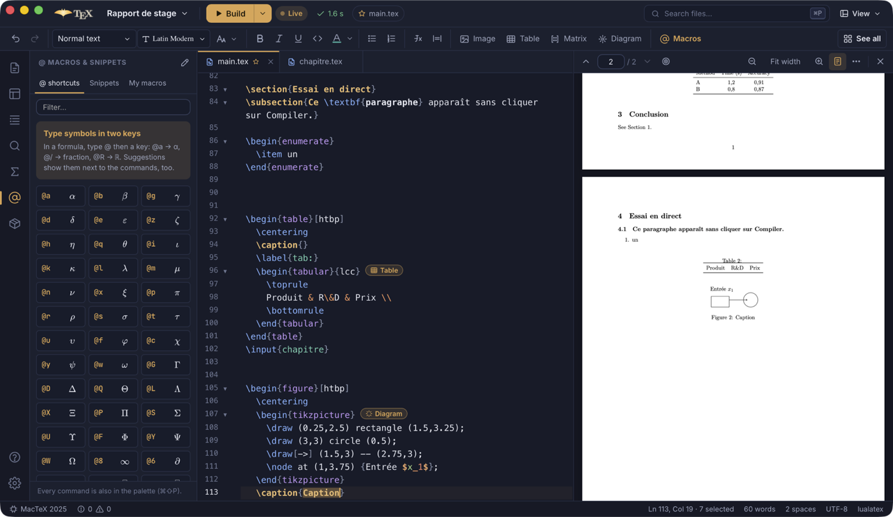
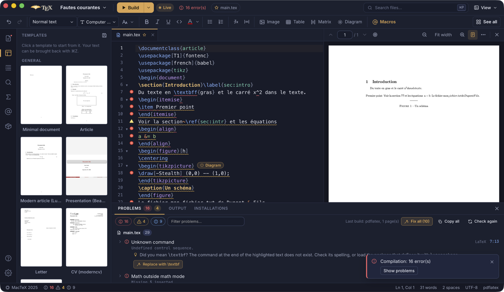
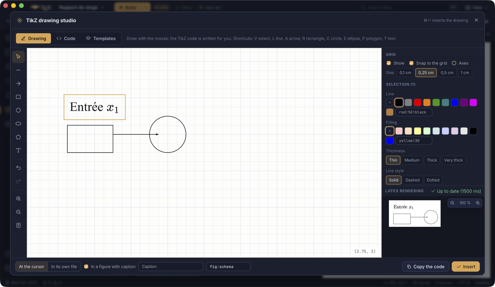

<p align="center">
  
</p>

<h1 align="center">RayTeX</h1>

<p align="center">
  <strong>A modern LaTeX IDE for students, teachers and researchers.</strong><br />
  Fast, open source, for Linux, macOS and Windows. Written in Rust.
</p>

<p align="center">
  <a href="https://github.com/ifanoxy/raytex/actions/workflows/ci.yml"></a>
  <a href="#license"></a>
  <a href="https://github.com/ifanoxy/raytex/releases"></a>
</p>

<p align="center">
  English · <a href="README.fr.md">Français</a>
</p>

---

RayTeX is a LaTeX editor that helps beginners learn and lets experts go fast: live preview, completion learned from **every** installed package, a precise error console that explains every problem and fixes the common ones in one click (or all at once), SyncTeX, templates, macros and a guided setup of **any** TeX distribution.

<p align="center">
  
</p>

## Features

**Writing**
- A formatting bar like a word processor's: undo / redo, heading style of the line, text size, bold, italic, underline, colour, alignment, lists, formulas, image, table (size picked on a grid), TikZ drawing, links and references; **See all** lists every command with its shortcut. The top bar keeps the project, the build and a **View** menu; the PDF preview and the console close with a cross.
- Context-aware completion: commands and environments of the LaTeX kernel, of every package your document loads (read from the package source, whatever the package), of your own `\newcommand`s; labels with their number, citations with authors and title, files, options, colours.
- Keys and values of arguments, with their documentation: `\includegraphics[width=…]`, `\begin{itemize}[label=…]`, `\hypersetup{…}`, `\geometry{…}`, siunitx, listings, minted, tcolorbox, fontspec, TikZ, pgfplots, beamer… (about 520 documented keys, plus the keys each installed package declares). In a free argument, a hint says what goes there (`\item[term]`: the text shown instead of the bullet).
- A matrix and table editor filled cell by cell (Enter to the next cell, paste from a spreadsheet, LaTeX formatting and macros in the cells, live preview); a chip after `\begin{pmatrix}`, `\begin{tabular}`, `\includegraphics` or `\begin{tikzpicture}` reopens the matching editor on that code.
- Completion creates the braces and leaves them empty for you to type; choosing a command from a package that is not loaded adds the `\usepackage`.
- Live math preview (KaTeX, with your macros), documentation on hover, image previews.
- Fonts from the formatting bar: the main, sans-serif, code and maths fonts of the document at a glance, each changed or reset in one click, plus fonts for passages applied to the selection; colours that follow the document (all `xcolor`, `dvipsnames` and SVG colours when xcolor is loaded, the document's own colours, any custom colour).
- Console and problems whose text can be selected and copied.
- `@` shortcuts in math mode (`@a` → `\alpha`, `@/` → fraction), shown next to the matching commands in completion and drawn in their own panel; snippets; personal macros with triggers and keyboard shortcuts.
- Go to definition, find references, rename labels / citation keys / commands across the project.
- `$` pairs only where a formula can start; renaming a `\begin{…}` renames its `\end{…}`; `Ctrl/⌘ + Z` undoes wherever the focus is, `Ctrl/⌘ + Shift + Z` or `Ctrl/⌘ + Y` redoes.
- Empty files suggest how to start (template, minimal document, section, inclusion in the main document, bibliography entries).
- Environment auto-closing, list continuation, folding, multiple cursors, Vim mode, spell checking.

**Images, drawings and fonts**
- *Insert images*: choose, paste or drop images (or pick those of the project); folder, LaTeX-safe file name, width with a page preview, placement, caption and label; several images become sub-figures. SVG is converted to vector PDF, WebP/GIF/HEIC/BMP/TIFF to PNG; `graphicx`, `subcaption`, `float` are added when needed.
- *TikZ studio*: a **whiteboard** to draw with the mouse on a fine, adjustable grid (the TikZ code writes itself and stays in step with the drawing both ways), a gallery of 22 drawings (plots, flowchart, tree, mind map, Venn, geometry, circuit, automaton, graph, neural network, commutative diagram…), element and style buttons, a live preview compiled with the document's preamble, a centimetre grid, click-to-insert coordinates, insertion at the cursor or in its own file, packages and `\usetikzlibrary` added automatically; edit an existing drawing in place.
- *Fonts*: any font of the computer or font files copied into the project (fontspec, each style named, engine switched to LuaLaTeX), or LaTeX font packages that also work with pdfLaTeX, all with a compiled preview.

**Building**
- Live by default: the document is compiled after each pause in typing and the PDF follows; or one key (`Ctrl/⌘ + Enter`), or on save.
- The console never opens by itself: errors are underlined, counted in the top bar and announced after a build you asked for.
- Automatic engine choice (`% !TEX program`, `fontspec` → LuaLaTeX, Tectonic, pdfLaTeX).
- Precompiled preambles (pdfLaTeX): prepared in the background, passes 35–60 % faster.
- Smart build driver: Biber / BibTeX / makeindex / glossaries only when their inputs changed, reruns until references are stable; or latexmk, a single pass, or your own steps.
- Auxiliary files in `build/`; the project stays clean.

**Understanding errors**
- Lint while typing: undefined references and citations, duplicate labels, unbalanced braces, missing packages and files, obsolete commands, typography.
- Log parser that pinpoints the exact line and column, with a plain-language explanation (English and French) and fixes: add or install a package, fix a misspelt command, switch engines, create a missing file…

**PDF**
- Built-in viewer (pdf.js): only visible pages are rendered, reloads keep your position, text selection, dark mode.
- SyncTeX both ways, with a native parser (double-click in the PDF → source; `Ctrl/⌘ + Alt + J` → PDF).

**Any TeX distribution, every package**
- Detects TeX Live, MacTeX, MiKTeX, TinyTeX, Tectonic and Linux system TeX Live; lets you choose one or add custom folders.
- Guided installation of a distribution for your OS, showing the exact commands before running them.
- Installs missing packages with the right tool (tlmgr, MiKTeX, dnf/zypper…), in user mode when possible, asking for administrator rights only when needed.
- Browse installed packages and the whole CTAN catalogue; `texdoc` documentation.

**Projects**
- A projects folder (`Documents/RayTeX` by default) and a **My projects** browser with previews of each PDF, search, recent projects and files.
- Light mode: open a single `.tex` file, edit it and export its PDF without creating any file next to it; make it a project in one step when images or other files are needed.
- New projects start empty; the **Templates** panel shows each template by its first page (shipped with the application, whatever your distribution) and puts it in the document in one undoable click.
- 16 templates (article, report, thesis, research article, slides, poster, course notes, exam, exercise sheet, homework, lab report, letter, CV, TikZ figure…), all building without warnings, in English and French.
- Project settings in `raytex.toml`, versioned with the project.
- Command palette, quick open, project search and replace, outline with real numbers, TODO list, session restore.
- Help centre: guides, command reference, symbol palette, common errors explained, shortcuts.

The interface is available in English and French.

<p align="center">
  
  
</p>

## Install

Download the installer for your system from the [releases page](https://github.com/ifanoxy/raytex/releases) (`.dmg` for macOS, `.msi` or `.exe` for Windows, `.AppImage` or `.deb` for Linux), then open RayTeX: if no TeX distribution is found, the setup assistant helps you install one.

The builds are not signed yet:

- **macOS**: the first time, right-click RayTeX in *Applications* and choose *Open* (or run `xattr -dr com.apple.quarantine /Applications/RayTeX.app`).
- **Windows**: if SmartScreen stops the installer, click *More info* then *Run anyway*.

## Build from source

Requirements: [Rust](https://rustup.rs) 1.88 or newer (stable), [Node.js](https://nodejs.org) 22.12+, and the [Tauri prerequisites](https://v2.tauri.app/start/prerequisites/) of your OS (WebKitGTK on Linux, WebView2 and the C++ build tools on Windows — see [docs/WINDOWS.md](docs/WINDOWS.md)).

```bash
npm install
npm run app:dev      # run the desktop application in development mode
npm run app:build    # build installers in target/release/bundle
```

Other useful commands:

```bash
cargo test --workspace                 # engine tests
cargo test -p raytex-core -- --ignored   # tests that need a TeX distribution / the network
npm test                               # interface tests
npm run check                          # type-check the interface
npm run dev                            # interface alone in a browser, with a simulated engine
node scripts/e2e.mjs                   # end-to-end scenes of the real application
```

## Command line

The engine is also available as a command-line tool, `raytex`:

```bash
cargo run -p raytex-cli -- doctor            # distributions, tools and advice
cargo run -p raytex-cli -- build main.tex    # build with the smart driver
cargo run -p raytex-cli -- lint chapter.tex  # check without building
cargo run -p raytex-cli -- new thesis my-thesis --title "My thesis"
cargo run -p raytex-cli -- install siunitx
```

Every command accepts `--lang en|fr` and `--json`.

## Project layout

```
crates/
  raytex-core/     the engine, without any user interface (pure Rust)
    data/              knowledge base, templates, help guides, error explanations
  raytex-cli/      the `raytex` command-line tool
  raytex-desktop/  the desktop application (Tauri 2): IPC commands, events, file watcher
ui/                    the interface (Svelte 5 + TypeScript + CodeMirror 6 + pdf.js)
assets/                logo sources
docs/                  architecture, Windows, data formats, screenshots
tests/e2e/             project used by the end-to-end scenes
```

Read [docs/ARCHITECTURE.md](docs/ARCHITECTURE.md) for how the pieces fit together, [docs/knowledge-base.md](docs/knowledge-base.md) to add package documentation or templates, and [CONTRIBUTING.md](CONTRIBUTING.md) to contribute.

## Contributing

Bug reports, ideas, package documentation, templates, translations and code are all welcome: read [CONTRIBUTING.md](CONTRIBUTING.md). Please follow the [code of conduct](CODE_OF_CONDUCT.md); report security problems privately as explained in [SECURITY.md](SECURITY.md). The changes of each version are in [CHANGELOG.md](CHANGELOG.md).

## License

RayTeX is free software, dual-licensed under the [MIT](LICENSE-MIT) and [Apache 2.0](LICENSE-APACHE) licenses, at your option. Unless you state otherwise, any contribution you submit is licensed the same way.

The third-party components shipped with the application (fonts, pdf.js, KaTeX…) keep their own licenses: see [THIRD_PARTY.md](THIRD_PARTY.md).
